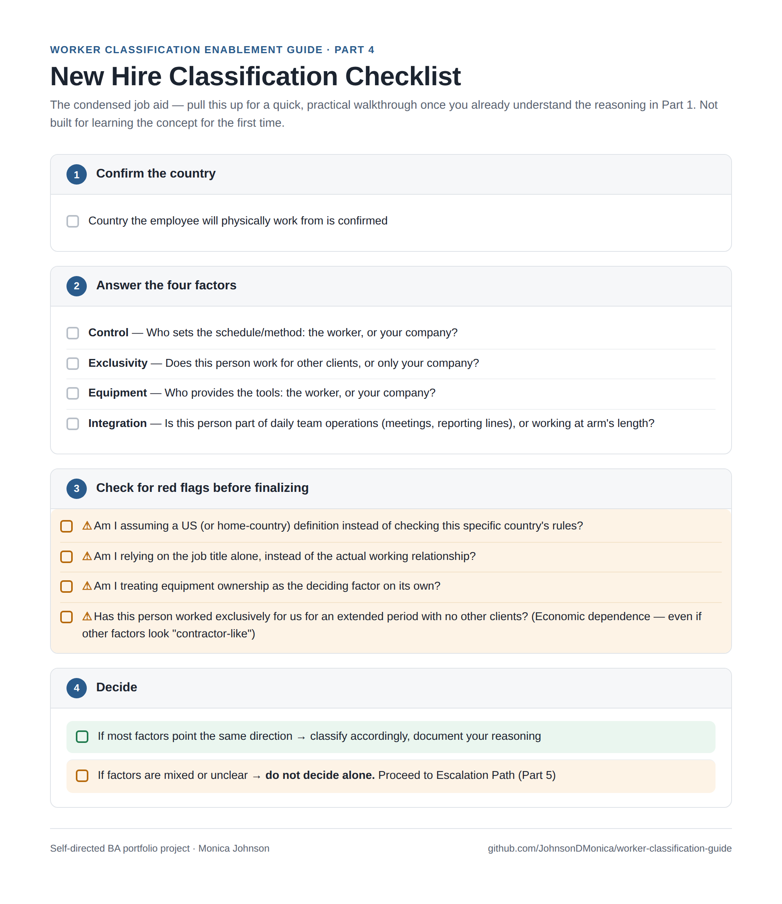

# Worker Classification Enablement Guide

*A guide for new HR admins on correctly classifying international hires as contractors or full-time employees.*

**How to use this guide:** it's built in five parts that build on each other. The **Guide** below lays out the core concept and reasoning. **Worked Examples** then shows that reasoning applied to real scenarios, including one genuinely tricky case. **Common Mistakes** names the specific errors people tend to make once they think they've got it. Once you've read all of that once, the **Job Aid** is a condensed checklist to come back to for future hires, without needing to re-read everything. And the **Escalation Path** is your safety net for anything that doesn't fit cleanly into what's covered here.

---

## Part 1: The Guide

> *This guide provides a general framework for understanding worker classification. It is not legal advice. Always confirm specific classification decisions with your organization's legal or compliance team before finalizing a new hire's status.*

**What Is an EOR?**

An Employer of Record (EOR) is a company that legally employs workers on your company's behalf, in the worker's own country — even when your company has no legal entity there. This is what makes it possible to hire someone in, say, Portugal, without your company needing to set up a Portuguese legal entity yourself. The EOR handles local payroll, tax withholding, and legal compliance, while the worker does their actual day-to-day job for your team.

**Why This Matters for Classification**

Every new hire must be classified correctly — as a contractor or a full-time employee — and getting this wrong isn't just an internal paperwork issue. Misclassification can expose your company to fines, back-pay obligations, and legal penalties in the worker's country. The single most important rule to internalize before anything else:

> **The employment law that applies is always determined by the country where the employee physically works — never a blend with, or comparison to, your company's home country.**

**How to Classify a New Hire, Step by Step**

1. **Determine the country the employee will physically work from.** This must come first — it determines which country's laws apply to everything that follows.

2. **Learn that specific country's classification rules.** Every country defines "contractor" vs. "employee" differently. A working arrangement that's clearly a contractor role in the U.S. may legally count as employment in another country — the definitions don't transfer.

3. **Classify based on the actual working relationship, tested against that country's specific rules.** Most countries' rules center on a similar set of real-world questions:

   - **Control** — Does the company dictate *how* and *when* the work gets done, or only the final outcome?
   - **Exclusivity** — Does this person work only for your company, or do they serve multiple clients?
   - **Equipment** — Who provides the tools/equipment — the worker, or your company?
   - **Integration** — Is this person embedded in day-to-day company operations, or working at arm's length?

   The more these answers point toward company control, exclusivity, and integration, the more likely the role legally qualifies as employment — regardless of what title your company intended to give it.

---

## Part 2: Worked Examples

You've now seen the four factors — control, exclusivity, equipment, and integration. Here's what they actually look like applied to real hiring scenarios, moving from a clear case to a genuinely uncertain one.

**Example 1: Clear-Cut Employee**
*Anna is being hired in Germany to run marketing campaigns.* She'll work exclusively for the company, follow a set 9-to-5 schedule set by her manager, use company-issued equipment, and attend daily team meetings as a core part of the marketing department.

Applying the factors: high control (set schedule, managed by a supervisor), full exclusivity, company-provided equipment, and deep integration into daily operations. All four factors point the same direction — this strongly resembles an **employee** relationship, not a contractor one. (Germany specifically has strict rules against disguising real employment as "freelance" work — a pattern worth being extra cautious around.)

**Example 2: Clear-Cut Contractor**
*Marcos is a freelance graphic designer based in Brazil*, hired to design a handful of marketing assets. He sets his own hours, uses his own laptop and design software, and simultaneously works for three other clients unrelated to this company.

Applying the factors: low control (no set schedule, no supervisor directing his day), no exclusivity, his own equipment, and no integration into daily company operations. This clearly resembles a genuine **contractor** relationship.

**Example 3: The Genuinely Ambiguous Case**
*Priya is a software developer in Canada*, hired on a "contractor" basis. She sets her own working hours day-to-day, but she's required to attend the team's daily standup meeting. She uses her own laptop, but has worked exclusively for this company for the past year with no other clients.

Applying the factors: this one doesn't point cleanly in one direction — low-to-moderate control, but full exclusivity and meaningful integration (daily standups, year-long exclusive relationship), against her providing her own equipment. **This is exactly the kind of case that shouldn't be decided alone** — see Escalation Path.

---

## Part 3: Common Mistakes

Even with the reasoning and examples above, the same handful of errors tend to show up again and again. Here's what to actively watch for in your own thinking.

**Mistake 1: Assuming Your Home Country's Definition Transfers**
The single most common error: applying US intuition about what "contractor" means to a country with completely different rules. Just because someone would clearly be a contractor under US standards doesn't mean the same arrangement qualifies as a contractor somewhere else. Always start from the *worker's* country's rules, not your own assumptions.

**Mistake 2: Treating the Job Title as the Decision**
Calling someone a "contractor" in an offer letter doesn't make them one legally. Classification is determined by the actual working relationship (control, exclusivity, equipment, integration) — not by whatever title your company intended to use. A mislabeled title provides no legal protection if the real relationship looks like employment.

**Mistake 3: Treating Equipment Ownership as the Deciding Factor**
It's tempting to think "they use their own laptop, so they must be a contractor" — but equipment ownership is usually one of the *weaker* factors, easily outweighed by things like exclusivity or how integrated someone is into daily operations. Don't let one easy-to-check box override the fuller picture.

**Mistake 4: Missing Economic Dependence**
A worker who technically sets their own hours and owns their equipment can still functionally be an employee if they've worked exclusively for your company for an extended period, with no other clients. This pattern is easy to miss because it develops gradually — a contractor relationship that started clearly can quietly drift into employee territory over time without anyone re-evaluating it.

---

## Part 4: Job Aid

Once the reasoning above makes sense, you won't need to re-read all of it for every new hire. This checklist is the condensed version — pull it up in the moment, for a quick, practical walkthrough.

*(This section assumes you already understand the reasoning in Part 1. It's built for quick reference, not for learning the concept for the first time.)*

**New Hire Classification Checklist**

**Step 1: Confirm the country**
- [ ] Country the employee will physically work from is confirmed

**Step 2: Answer the four factors**
- [ ] **Control** — Who sets the schedule/method: the worker, or your company?
- [ ] **Exclusivity** — Does this person work for other clients, or only your company?
- [ ] **Equipment** — Who provides the tools: the worker, or your company?
- [ ] **Integration** — Is this person part of daily team operations (meetings, reporting lines), or working at arm's length?

**Step 3: Check for red flags before finalizing**
- [ ] ⚠️ Am I assuming a US (or home-country) definition instead of checking this specific country's rules?
- [ ] ⚠️ Am I relying on the job title alone, instead of the actual working relationship?
- [ ] ⚠️ Am I treating equipment ownership as the deciding factor on its own?
- [ ] ⚠️ Has this person worked exclusively for us for an extended period with no other clients? (Economic dependence — even if other factors look "contractor-like")

**Step 4: Decide**
- [ ] If most factors point the same direction → classify accordingly, document your reasoning
- [ ] If factors are mixed or unclear → **do not decide alone.** Proceed to Escalation Path below

---

## Part 5: Escalation Path

Even after working through the checklist above, some cases — like Priya's, in the examples — genuinely won't resolve cleanly. That's expected, not a sign you're missing something. Here's what to do when that happens.

*This guide covers the most common patterns, but it can't account for every situation. When in doubt, don't guess — escalate.*

**Escalate to your Compliance/Legal team if:**
- The four factors point in different directions, with no clear majority (like Priya's case in the examples above)
- The country involved isn't one you've classified for before
- The working relationship has changed significantly since the original classification (e.g., a contractor who's grown into a long-term, exclusive relationship)
- Anything about the situation feels unclear, even if you can't pinpoint exactly why

**Before escalating, have ready:**
- The worker's country
- A brief description of the actual working relationship (schedule, exclusivity, equipment, integration)
- What you've already determined using this guide, and specifically where you got stuck

**Remember:** escalating isn't a failure — misclassifying a worker is a far costlier mistake than asking a question first.
